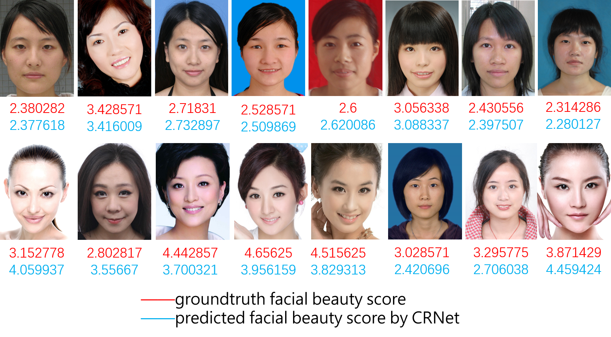
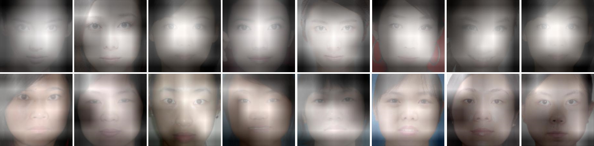

# CRNet: Classification and Regression Neural Network for Facial Beauty Prediction

## Introduction
This repository holds the PyTorch implementation for our paper [CRNet: Classification and Regression Neural Network for Facial Beauty Prediction](https://link.springer.com/chapter/10.1007/978-3-030-00764-5_61).


## Performance Comparison
CRNet achieves the state-of-the-art performance on [SCUT-FBP](http://www.hcii-lab.net/data/scut-fbp/en/introduce.html) 
and [ECCV HotOrNot](https://www.researchgate.net/publication/261595808_Female_Facial_Beauty_Dataset_ECCV2010_v10) dataset. For more details, please read our [paper](https://link.springer.com/chapter/10.1007/978-3-030-00764-5_61).
The cropped face images of SCUT-FBP dataset can be downloaded from [Google Drive](https://drive.google.com/open?id=1hDa9sqewrxW8xMhezU82p4wrv2fu9GoX).

### Performance Evaluation on SCUT-FBP
| Methods | PC |
| :---: | :---: |
| Gaussian Regression | 0.6482 |
| CNN-based | 0.8187 |
| PI-CNN | 0.87 |
| Liu et al. | 0.6938 |
| **CRNet** | **0.8723** |

### Performance Evaluation on HotOrNot
| Methods | PC |
| :---: | :---: |
| Multi-scale Model | 0.458 |
| S. Wang et al. | 0.437 |
| **CRNet** | **0.482** |

### Test



The most attractive parts learned by CRNet is shown as follows.




If you find the code or the experimental results useful in your research, 
please cite our paper:
```
@inproceedings{xu2018crnet,
  title={CRNet: Classification and Regression Neural Network for Facial Beauty Prediction},
  author={Xu, Lu and Xiang, Jinhai and Yuan, Xiaohui},
  booktitle={Pacific Rim Conference on Multimedia},
  pages={661--671},
  year={2018},
  organization={Springer}
}
```

### LICENSE
[MIT](./LICENSE)
